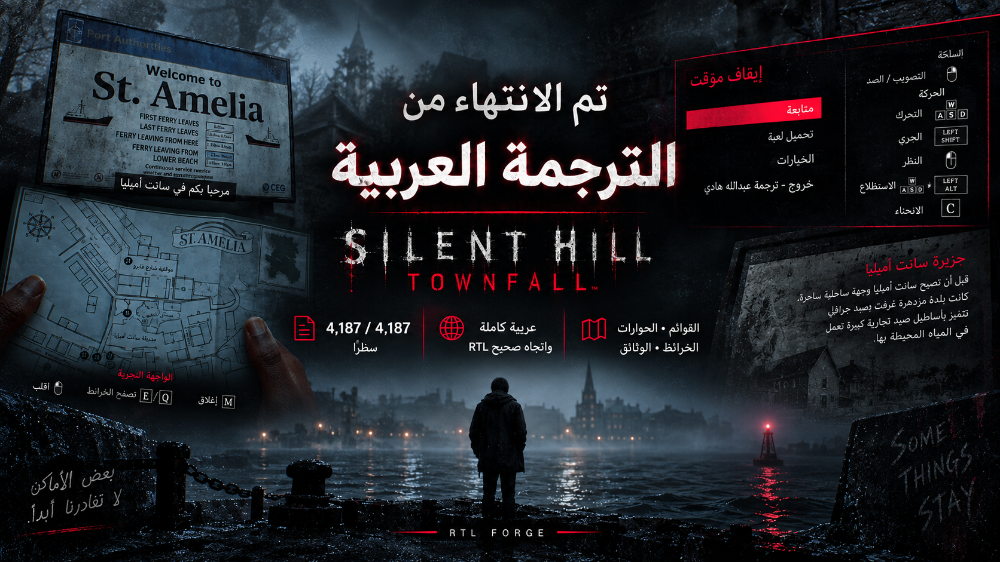

<div align="center">



# تعريب SILENT HILL: Townfall إلى العربية

**ترجمة كاملة للعبة — 4,187 سطرًا من أصل 4,187**

القوائم • الحوارات • الوثائق • الخرائط • اللافتات • الأجهزة • وصف الأصوات

### [⬇ حمّل المثبّت (18 ميجابايت)](https://github.com/AbudiHadi/silent-hill-townfall-arabic/raw/main/download/SilentHillTownfall-Arabic-Installer.exe)

<sub>أو [النسخة اليدوية](https://github.com/AbudiHadi/silent-hill-townfall-arabic/raw/main/download/SilentHillTownfall-Arabic-Manual.zip) إن كنت تفضّل نسخ الملف بنفسك</sub>

<sub>كل الإصدارات: [صفحة Releases](https://github.com/AbudiHadi/silent-hill-townfall-arabic/releases/latest)</sub>

</div>

---

## ما هذا؟

تعريب كامل وغير رسمي للعبة **SILENT HILL: Townfall** على الكمبيوتر (نسخة Steam).

كل نص في اللعبة مُترجم إلى العربية: قوائم الإعدادات، حوارات الشخصيات، الرسائل
الصوتية، الوثائق والملفات، أقراص الحاسوب، لافتات الشوارع، شاشات الأجهزة الطبية،
وحتى وصف الأصوات لضعاف السمع.

النص يظهر **من اليمين إلى اليسار** بشكل صحيح، والحروف متصلة كما يجب،
مع الحفاظ على رموز الأزرار مثل `TAB` و `R` في مكانها.

**الصوت يبقى بالإنجليزية** — الترجمة للنصوص فقط.

---

## ما الذي تحتاجه قبل البدء

| | |
|---|---|
| اللعبة | SILENT HILL: Townfall على Steam (نسخة الكمبيوتر) |
| المساحة | حوالي 55 ميجابايت إضافية |
| برامج | لا شيء — المثبّت يعمل مباشرة على ويندوز 10 و 11 |

---

## الطريقة الأولى: المثبّت (الأسهل — ينصح بها)

### 1) حمّل المثبّت

اضغط على الرابط التالي وسيبدأ التحميل مباشرة (حجمه 18 ميجابايت):

<div align="center">

### [⬇ SilentHillTownfall-Arabic-Installer.exe](https://github.com/AbudiHadi/silent-hill-townfall-arabic/raw/main/download/SilentHillTownfall-Arabic-Installer.exe)

</div>

> **ملاحظة:** قد يحذّرك ويندوز أو المتصفح لأن الملف غير موقّع رقميًا (التوقيع
> الرقمي يكلّف مالًا سنويًا). هذا طبيعي في التعريبات. إن ظهرت نافذة
> **"Windows protected your PC"** اضغط **More info** ثم **Run anyway**.
> إن كنت غير مرتاح، استخدم [الطريقة اليدوية](#الطريقة-الثانية-النسخ-اليدوي) بدلًا من ذلك.

### 2) أغلق اللعبة

تأكد أن اللعبة مغلقة تمامًا. المثبّت لن يعمل واللعبة مفتوحة، وسيخبرك بذلك.

### 3) شغّل المثبّت

افتح الملف الذي حمّلته. ستظهر نافذة عربية.

- المثبّت **يبحث عن اللعبة تلقائيًا** عبر Steam ويكتب مسارها في الخانة.
- إن لم يجدها (مثلًا لو كانت اللعبة على قرص آخر)، اضغط **استعراض…**
  واختر مجلد اللعبة يدويًا — وهو المجلد الذي يحتوي على ملف `Townfall.exe`.

### 4) اضغط «تثبيت التعريب»

سيقوم المثبّت بالآتي، وتراه كله في السجل داخل النافذة:

1. يتحقق من أن ملف اللعبة أصلي وغير معدّل.
2. يأخذ **نسخة احتياطية** من الملف الأصلي داخل مجلد `TownfallArabic_backup`.
3. يكتب ملف التعريب.
4. يتحقق من الملف بعد الكتابة للتأكد أنه سليم.

عند الانتهاء ستظهر رسالة خضراء: **«التعريب مثبّت»**.

### 5) شغّل اللعبة واختر العربية

هذه الخطوة **مهمة** — التعريب لن يظهر بدونها:

```
الخيارات  ←  خيارات اللعبة  ←  لغة النصوص  ←  العربية
```

وبس. استمتع.

---

## الطريقة الثانية: النسخ اليدوي

إن كنت تفضّل ألا تشغّل ملف `.exe`، يمكنك نسخ الملف بنفسك.

### 1) حمّل الملف اليدوي

حمّل الملف المضغوط (18 ميجابايت):

<div align="center">

### [⬇ SilentHillTownfall-Arabic-Manual.zip](https://github.com/AbudiHadi/silent-hill-townfall-arabic/raw/main/download/SilentHillTownfall-Arabic-Manual.zip)

</div>

وفك الضغط عنه. ستجد بداخله ملفًا اسمه `pakchunk1-Windows.pak`.

### 2) افتح مجلد اللعبة

في Steam:

1. اضغط بزر الفأرة **الأيمن** على اللعبة في المكتبة.
2. اختر **Manage** ← **Browse local files**.
3. سيفتح مجلد اللعبة. ادخل إلى المجلدات:

```
Townfall  →  Content  →  Paks
```

### 3) احفظ نسخة احتياطية (لا تتخطَّ هذه الخطوة)

داخل مجلد `Paks` ستجد ملفًا اسمه:

```
pakchunk1-Windows.pak
```

**انسخ هذا الملف والصقه في مكان آمن خارج مجلد اللعبة.** حجمه حوالي 2 ميجابايت.
هذه نسختك الأصلية التي ترجع إليها لاحقًا.

### 4) استبدل الملف

الصق ملف `pakchunk1-Windows.pak` الذي حمّلته داخل مجلد `Paks`،
واختر **استبدال / Replace** عندما يسألك ويندوز.

الملف الجديد حجمه حوالي 55 ميجابايت.

> **مهم جدًا:** يجب أن يكون اسم الملف **بالضبط** `pakchunk1-Windows.pak`.
> لا تضع الملف باسم آخر بجانب الملف الأصلي — اللعبة **ستتجاهله تمامًا**
> ولن يعمل التعريب. لا بد من **الاستبدال**، لا الإضافة.

### 5) شغّل اللعبة واختر العربية

```
الخيارات  ←  خيارات اللعبة  ←  لغة النصوص  ←  العربية
```

---

## كيف أرجع اللعبة إلى الإنجليزية؟

### إن استخدمت المثبّت

افتح المثبّت مرة أخرى واضغط **«استعادة الأصل»**. سيعيد الملف الأصلي من النسخة
الاحتياطية ويتحقق منه — وتعود اللعبة كما كانت تمامًا.

### إن نسخت يدويًا

أعد الملف الأصلي الذي حفظته في الخطوة 3 إلى مجلد `Paks`.

### إن فقدت النسخة الاحتياطية

لا مشكلة — Steam يعيدها لك مجانًا:

1. زر الفأرة الأيمن على اللعبة ← **Properties**
2. **Installed Files** ← **Verify integrity of game files**

سيحمّل Steam الملف الأصلي ويعيد اللعبة إلى حالتها الأولى.

---

## أسئلة شائعة

<details>
<summary><b>لماذا أختار «العربية» من مكان اللغة الفرنسية؟</b></summary>

<br>

اللعبة لا تحتوي على خانة لغة عربية أصلًا، ولا يمكن إضافة خانة جديدة من خارج
اللعبة. لذلك يحل التعريب محل خانة اللغة **الفرنسية**، ويغيّر اسمها في القائمة
إلى «العربية». باقي اللغات تبقى كما هي ولا تتأثر.

</details>

<details>
<summary><b>هل يؤثر التعريب على حفظ اللعبة أو الإنجازات؟</b></summary>

<br>

لا. التعريب يغيّر ملف النصوص والخطوط فقط. ملفات الحفظ والإنجازات لا تتأثر،
ويمكنك الرجوع للإنجليزية في أي وقت دون فقدان أي تقدّم.

</details>

<details>
<summary><b>هل يعمل مع تحديثات اللعبة القادمة؟</b></summary>

<br>

عند تحديث اللعبة، يستبدل Steam الملف المعدّل بالملف الأصلي، فيرجع النص
للإنجليزية. شغّل المثبّت مرة أخرى بعد التحديث.

إن تغيّرت نصوص اللعبة في التحديث، سيرفض المثبّت العمل ويخبرك بذلك — حمايةً لك
من تلف اللعبة — وسأصدر نسخة محدّثة من التعريب.

</details>

<details>
<summary><b>شغّلت اللعبة ولم يتغير شيء</b></summary>

<br>

تأكد من ثلاثة أمور:

1. أنك اخترت **العربية** من: الخيارات ← خيارات اللعبة ← لغة النصوص.
2. أنك **استبدلت** الملف ولم تضف ملفًا جديدًا بجانبه.
3. أن اسم الملف بالضبط `pakchunk1-Windows.pak` داخل `Townfall\Content\Paks`.

</details>

<details>
<summary><b>هل التعريب يعمل على PlayStation؟</b></summary>

<br>

لا. هذا التعريب لنسخة الكمبيوتر (Steam) فقط.

</details>

---

## ما الذي تُرجم بالضبط

| القسم | عدد الأسطر |
|---|---|
| واجهات وقوائم | 2,212 |
| أغراض ووثائق وأقراص | 988 |
| حوارات الشخصيات | 827 |
| وصف الأصوات (لضعاف السمع) | 105 |
| أسماء المتحدثين | 54 |
| **الإجمالي** | **4,187** |

بقيت بالإنجليزية عمدًا: أسماء الأشخاص في شارة النهاية، والعلامات التجارية مثل
`NVIDIA Reflex` و `DLSS`، وأسماء اللغات في قائمة اللغات، ووحدات القياس
مثل `kV` و `mA`، والأكواد والأرقام التي تُستخدم في الألغاز.

النصوص المرسومة داخل الصور (بعض اللافتات الفنية) لا يمكن ترجمتها بهذه الطريقة.

---

## تواصل معي

<div align="center">

[](https://discord.gg/k8Bnj3657j)
[](https://x.com/GGAbdulalah)
[](https://github.com/AbudiHadi)

**ترجمة: عبدالله هادي**

</div>

إن واجهتك مشكلة أو لاحظت خطأ في الترجمة، افتح
[Issue هنا](https://github.com/AbudiHadi/silent-hill-townfall-arabic/issues)
أو راسلني على الديسكورد.

---

## إخلاء مسؤولية

هذا مشروع من صنع المعجبين، غير رسمي وغير مرتبط بـ **Konami** أو
**Screen Burn** أو **Annapurna Interactive**، ولا مدعوم منهم.

جميع حقوق اللعبة وأسمائها وصورها تعود لأصحابها. هذا التعريب يُوزَّع مجانًا
ولا يُباع، ولا يحتوي على أي ملفات من اللعبة الأصلية عدا ملف النصوص المعدّل
الذي لا يعمل إلا مع نسخة أصلية مملوكة من اللعبة.
